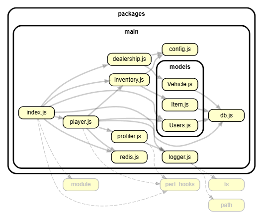

# Чистый и оптимизированный сервер для RAGE MP (Node.js / Vue 3 / Sequelize / Redis)

Привет! Это каркас игрового сервера для **RAGE Multiplayer (GTA V)**. Я написал его, используя современный стек технологий, и решил главные болячки, с которыми постоянно сталкиваются разработчики на этой платформе (зависание худа, конфликты кнопок с чатом и нагрузка на базу данных).

---

## 🛠 Из чего состоит проект (Стек)
*   **Бэкенд:** Node.js, RAGE MP API
*   **База данных (ORM):** MySQL, работа с таблицами через **Sequelize ORM** (никаких сырых SQL-запросов строками).
*   **Кэширование:** **Redis** (сверхбыстрая база данных в оперативной памяти для разгрузки жесткого диска).
*   **Интерфейсы (CEF):** Vue 3 (Composition API, сборщик Vite), архитектура SPA (одно окно браузера на всю игру).
*   **Логи и замеры:** Встроенный модуль `perf_hooks` и кастомное логирование ошибок в файлы.

---

## 🏗 Ключевые фичи и как я их решил

### 1. Карта зависимостей проекта (Как связаны файлы)
Чтобы проект не превратился в «кашу» из файлов, я разделил логику по слоям. Точка входа запускает модули, модули работают с базой через слой моделей. Ниже визуальный граф всех связей бэкенда, который я сгенерировал через утилиту `dependency-cruiser`:

*Благодаря правильному порядку подключения, в проекте нет «циклических импортов» и сервер запускается стабильно.*

### 2. Оптимизация работы с базой данных (Sequelize + Redis)
*   **Моментальные баны (HWID Ban):** Черный список компьютеров читеров хранится в оперативной памяти Redis (`Set`). Проверка происходит мгновенно при входе. Если игрок забанен, сервер отсекает его сразу, даже не делая тяжелый запрос в MySQL.
*   **Умный счетчик игроков в HUD:** Общее число аккаунтов кэшируется в Redis. Когда регистрируется новый игрок, счетчик в памяти просто увеличивается на `+1`. Не нужно каждую секунду мучить MySQL тяжелыми запросами `SELECT COUNT(*)`.
*   **Защита от крашей (Alt+F4):** Позиция игрока сохраняется в переменную каждые 3 секунды, а в MySQL записывается только в момент выхода (`playerQuit`). Это убирает постоянную нагрузку на жесткий диск и решает баг, когда при краше игры у игрока стирались координаты и он спавнился в океане (`0,0,0`).

### 3. Защита чата и блокировка ходьбы (UX-фиксы в игре)
*   **Защита чата от ложных срабатываний:** С помощью WinAPI-перехвата клавиш (`mp.keys.bind` на отпускание кнопки **T**) клиент игры сам понимает, когда открыт чат. Если вы пишете сообщение в чат, клавиши инвентаря (**I**), автосалона (**E**) и телефона (**P**) полностью блокируются. Окна не выскочат поверх текста, как это бывает на других серверах.
*   **Заморозка персонажа:** Когда вы открываете инвентарь, телефон или автосалон, на покадровом уровне (`render`) отключаются кнопки WASD, прыжок и мышка. Вы не упадете с горы и не ударите кулаком воздух, пока лазите в меню.
*   **Data-Driven фронтенд без зависаний:** Интерфейс написан на Vue 3 как SPA. Браузер создается один раз при старте игры. Данные от сервера (деньги, инвентарь, машины) принимает главный файл `App.vue` и реактивно передает их в худ, телефон и инвентарь через `Props`. Список машин в автосалоне подгружается динамически из конфига сервера через цикл `v-for`.

---

## 💻 Команды для проверки проекта в игре
*   `/checkban [логин]` — Команда-демонстрация скорости Redis. Первый раз сервер идет в MySQL (~12-15 мс), сохраняет кэш, а второй раз забирает из Redis ОЗУ за **~0.004 мс** (быстрее в 1000 раз!). Тайминги выводятся прямо в чат.
*   `/test` — Красивый вывод всей таблицы аккаунтов в консоль сервера в виде аккуратной таблицы `console.table()`.
*   `/giveitem [phone/burger/water] [кол-во]` — Выдача предмета админом. Сервер сам найдет свободный слот в инвентаре игрока и проверит лимит стака.
*   `/delacc [логин]` — Полное удаление аккаунта из базы, очистка его вещей/машин и принудительный кик игрока с сервера через безопасный перебор пула `mp.players.forEach`.
