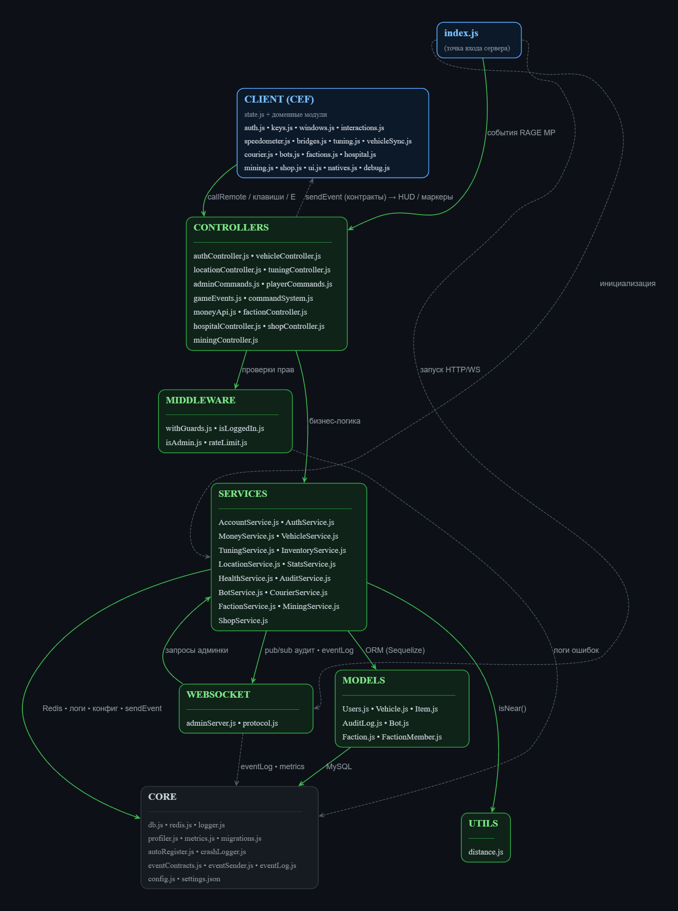

# Игровой сервер RAGE MP с чистой архитектурой (Node.js / Vue 3 / Sequelize / Redis)


Привет! Это каркас игрового сервера для **RAGE Multiplayer (GTA V)**. Проект построен на современном стеке и решает типичные боли платформы: зависание HUD, конфликты клавиш с чатом, лишняя нагрузка на БД и «спагетти-код» без слоёв.

---

## 🛠 Стек технологий

* **Бэкенд:** Node.js, RAGE MP API
* **База данных (ORM):** MySQL + **Sequelize ORM** — никаких «сырых SQL строками»
* **Кэширование:** **Redis** — хранение в ОЗУ для разгрузки MySQL
* **Интерфейсы (CEF):** Vue 3 (Composition API, Vite), архитектура SPA — одно браузерное окно на всю игру
* **Логи и замеры:** кастомный `logger` (winston) + `perf_hooks` для профилирования

---

## 📊 Производительность

| Операция | MySQL | Redis | Эффект |
|---|---|---|---|
| Проверка игрока (`/checkban`) | ~12–15 мс | ~0.004 мс | **~x3000 быстрее** |
| Счётчик аккаунтов для HUD | `COUNT(*)` на каждый запрос | `INCR` при регистрации | ноль тяжёлых запросов в игре |
| Списание денег | атомарный `UPDATE` с проверкой баланса | — | нет race condition |
| Позиция игрока | запись только при выходе | — | ноль нагрузки на диск в сессии |

Тайминги можно увидеть прямо в игре: команда `/checkban [логин]` выводит в чат время ответа MySQL и Redis.

---

## 🏗 Архитектура: 4 слоя

### 1. Сервисы (`services/`) — бизнес-логика и данные

| Сервис | Ответственность |
|---|---|
| `AccountService` | CRUD аккаунтов, поиск по логину, сохранение позиции |
| `AuthService` | bcrypt-хэширование, вход и регистрация |
| `MoneyService` | Атомарные денежные операции, проверка баланса |
| `VehicleService` | Покупка/спавн машин, учёт заспавненных авто |
| `TuningService` | Тюнинг, серверные цены, проверка «уже установлено» |
| `InventoryService` | Предметы, стакинг с `maxStack`, проверка вместимости |
| `LocationService` | Маркеры и blips из единого конфига |
| `StatsService` | Агрегации экономики (SUM/AVG/MAX), топ игроков, онлайн; Redis-кэш с TTL |
| `HealthService` | Здоровье игрока, смерть, респаун в больнице; clamp HP 1–100 |
| `AuditService` | Журнал бизнес-событий (audit_logs); коалесценция провалов через Redis — защита БД от флуда |

### 2. Контроллеры (`controllers/`) — тонкие обработчики событий

```javascript
mp.events.add('server:custom:buyUpgrade', withGuards([isLoggedIn], async (player, categoryKey, optionJson, price) => {
    // только бизнес-логика: проверки и ошибки уже решены middleware
}, 'custom:buyUpgrade'));
```

### 3. Middleware (`middleware/`) — проверки и error boundary

* `isLoggedIn` — авторизован ли игрок
* `isAdmin(level)` — фабрика проверок уровня прав
* `withGuards` — цепочка проверок + единый перехват ошибок

```javascript
// композиция: только админ может вызвать команду
withGuards([isLoggedIn, isAdmin(1)], async (player, args) => { ... }, 'delacc');
```

### 4. Модели (`models/`) — Sequelize с ленивой инициализацией

```javascript
// модель создаётся при первом вызове, а не при require —
// порядок подключения модулей больше не ломает сервер
function getItemModel() {
    if (!Item) { initItemModel() }
    return Item
}
```

---

## 🤔 Design decisions (почему именно так)

### Почему сервисы, а не один большой файл?

**Было:** логика денег, машин и инвентаря размазана по `player.js` / `dealership.js` — правка бага = правка 500 строк.

**Стало:** каждый сервис изолирован и переиспользуется. `MoneyService` списывает деньги и в автосалоне, и в тюнинге, и в телефоне.

```javascript
// VehicleService: покупка = деньги + запись, а контроллер лишь вызывает:
const paid = await moneyService.takeMoney(userId, config.price, `покупка ${config.name}`);
if (!paid) return { success: false, error: 'not_enough_money' };
await getVehicleModel().create({ owner_id: userId, model });
```

### Почему атомарный SQL для денег?

Классический `SELECT` → проверка → `UPDATE` ломается при параллельных запросах (дюп денег). Сервер использует одну атомарную операцию — БД сама не даст уйти в минус:

```sql
UPDATE accounts SET money = money - 15000
WHERE id = 123 AND money >= 15000
```

### Почему каталог тюнинга живёт на сервере?

Клиент **не диктует цены**: `TuningConfig` в `config.js` — единственный источник правды. Vue получает каталог с сервера и лишь отображает его, а сервер валидирует каждую покупку по whitelist опций. Читер, приславший цену $1, получит серверную цену и запись в логе.

---

## 🎮 Ключевые фичи

### 1. Тюнинг транспорта (LSC)

* **Бинарная система «купил / не купил»:** купил двигатель → в БД `engine_mod = 3` (топ-уровень). Повторная покупка → «Эта модификация уже установлена».
* **Задел на будущее:** БД уже хранит уровни (0–3), поэтому выбор L1/L2/L3 добавится без миграций.
* **Синхронизация между игроками:** `DataHandler` для `customColor`, `customWheels`, `customMod_11/12/13/18` + `entityStreamIn` применяет моды при появлении машины в стриме.

### 2. Умная работа с БД

* **Кэш в Redis:** счётчик аккаунтов и проверка игроков живут в ОЗУ; MySQL дёргается только при промахе кэша.
* **Защита от крашей (Alt+F4):** позиция игрока обновляется в памяти каждые 3 секунды, а в MySQL пишется один раз при выходе — игрок не спавнится в океане после краша игры.

### 3. UX: чат, ESC, заморозка

* **Защита чата:** перехват отпускания клавиши **T** — пока пишешь сообщение, бинды **I / E / P** заблокированы и окна не выскакивают поверх текста.
* **Заморозка персонажа:** при открытом UI на уровне `render` отключаются WASD, прыжок и мышь.
* **Фокус-трап:** невидимое поле ловит фокус, ESC корректно закрывает любое окно и возвращает курсор/камеру.

### 4. Data-Driven фронтенд

`App.vue` принимает данные от сервера (деньги, инвентарь, машины, каталог тюнинга) и реактивно раздаёт их компонентам через props. Списки машин и опций тюнинга рендерятся через `v-for` из серверных конфигов — интерфейс и сервер не могут рассинхронизироваться.

---

## 🛡 Обработка ошибок

Вместо `try/catch` в каждом обработчике — единый error boundary:

```javascript
function withGuards(guards, handler, label = '') {
    return async (player, ...args) => {
        for (const guard of guards) {
            if (!guard(player)) return;   // проверка не прошла — молча выходим
        }
        try {
            await handler(player, ...args);
        } catch (err) {
            logger.error(`[Handler ${label}] ${err.message}`); // ошибка одного события не роняет сервер
        }
    };
}
```

Плюс валидация на границе входа: битый JSON, левые опции тюнинга и отрицательные количества отклоняются до того, как дойдут до БД.

---

## 💻 Админ-команды (уровень 1+)

| Команда | Описание |
|---|---|
| `/checkban [логин]` | Демо скорости: MySQL ~12–15 мс против Redis ~0.004 мс, тайминги в чате |
| `/givemoney [сумма]` | Выдать себе деньги |
| `/giveitem [phone/burger/water] [кол-во]` | Выдать предмет с авто-стакингом и проверкой слотов |
| `/bd` | Таблица аккаунтов в консоли сервера |
| `/stats` | Витрина статистики: экономика, топ богачей, онлайн + время MySQL vs Redis |
| `/delacc [логин]` | Каскадное удаление аккаунта (вещи/машины) + кик игрока |
| `/sethp [1-100]` | Установить здоровье (кламп до 100) |
| `/heal` | Полное восстановление здоровья |
| `/kill` | Самоубийство (для теста респауна) |
| `/pay [ник] [сумма]` | Перевод игроку в одной SQL-транзакции |
| `/audit [лимит] [категория]` | Просмотр журнала бизнес-событий |

**Горячие клавиши:** `I` — инвентарь, `P` — телефон, `E` — взаимодействие с маркерами, `ESC` — закрыть окно, `F5` — debug-окно с координатами и логами (только админ), `Ё` — режим камеры в LSC.

---

## 🗺 Карта зависимостей



Благодаря послойному подключению и ленивой инициализации моделей в проекте нет циклических импортов — сервер стартует стабильно.

*Полный граф зависимостей по файлам (для глубокого изучения): [`docs/deps-full.dot`](docs/deps-full.dot) (генерируется через `dependency-cruiser`)*

---

## 🚀 Установка и запуск

```bash
# 1. Бэкенд
cd packages/main
npm install

# 2. Фронтенд (в отдельном терминале)
cd UI-Server
npm install
npm run dev   # Vite на http://localhost:5173
```

**Настройка:**
1. Скопируй `packages/main/settings.example.json` → `settings.json` и замени плейсхолдеры на свои данные (пароли, хосты). **Важно:** `settings.json` уже в `.gitignore` — он не попадёт в репозиторий.
2. Запусти сервер — таблицы `accounts`, `vehicles`, `items` создаются автоматически при первом старте.
3. Redis заполнится статистикой аккаунтов при запуске.

---

## 📈 Точки роста

- [ ] Античит: валидация дистанции до маркеров (`locationService.isNear`)
- [ ] Уровни прокачки в LSC (БД уже готова — нужно только расширить UI)
