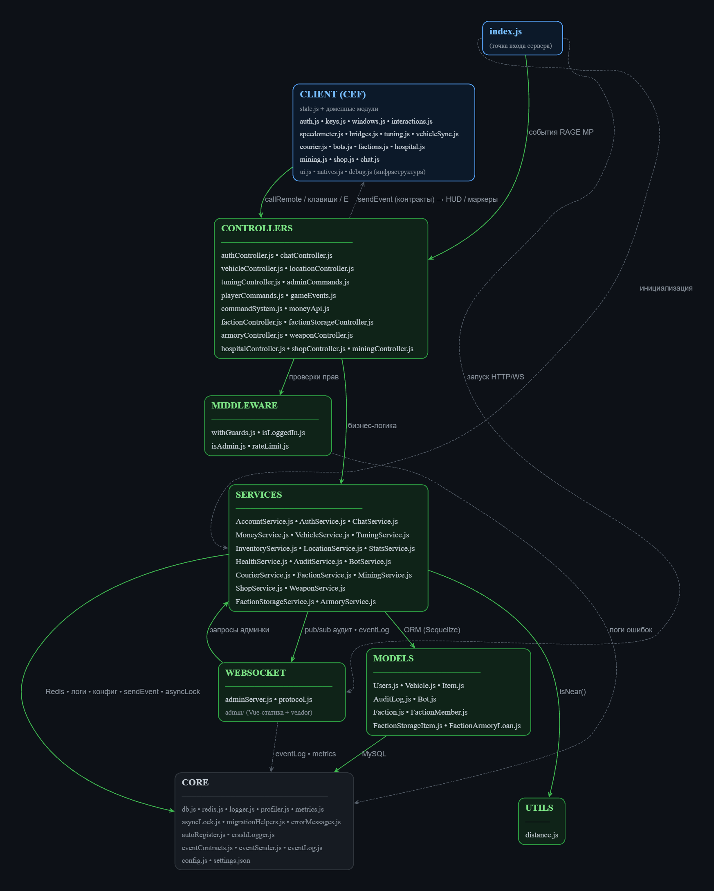

# Игровой сервер RAGE MP с чистой архитектурой (Node.js / Vue 3 / Sequelize / Redis)


Каркас игрового сервера для **RAGE Multiplayer (GTA V)**: послойная архитектура (контроллеры → сервисы → модели), server-authoritative логика, атомарные SQL-транзакции, сериализация гонок через async-мьютекс, Redis-кэширование и real-time веб-админка.

**Оглавление:** [Стек](#-стек-технологий) • [Производительность](#-производительность) • [Архитектура](#-архитектура) • [Ключевые фичи](#-ключевые-фичи) • [Веб-админка](#-веб-админка) • [Установка](#-установка-и-запуск) • [Точки роста](#-точки-роста)

---

## 🛠 Стек технологий

- **Бэкенд:** Node.js, RAGE MP API
- **База данных (ORM):** MySQL + **Sequelize ORM** — никаких «сырых SQL строками»
- **Кэширование:** **Redis** — хранение в ОЗУ для разгрузки MySQL
- **Конкурентность:** ключевой async-мьютекс `core/asyncLock.js` — сериализация read-modify-write на одну сущность
- **Интерфейсы (CEF):** Vue 3 (Composition API, Vite), архитектура SPA — одно браузерное окно на всю игру
- **Веб-админка:** WebSocket + JWT, live-таблицы и карта игроков (CanvasMapper)
- **Тесты:** Jest — сервер и клиент (глобальный мок `mp.*` API), CI на GitHub Actions
- **Логи и замеры:** кастомный async-логгер + `perf_hooks` для профилирования

---

## 📊 Производительность

| Операция                      | MySQL                                  | Redis                  | Эффект                         |
| ----------------------------- | -------------------------------------- | ---------------------- | ------------------------------ |
| Проверка игрока (`/checkban`) | ~12–15 мс                              | ~0.004 мс              | **~x3000 быстрее**             |
| Счётчик аккаунтов для HUD     | `COUNT(*)` на каждый запрос            | `INCR` при регистрации | ноль тяжёлых запросов в игре   |
| Списание денег                | атомарный `UPDATE` с проверкой баланса | —                      | нет race condition             |
| Позиция игрока                | запись только при выходе               | —                      | ноль нагрузки на диск в сессии |

Тайминги можно увидеть прямо в игре: `/checkban [логин]` и `/bench` выводят время ответа MySQL и Redis.

---

## 🏗 Архитектура



- **17 контроллеров** по доменам, **19 сервисов**, **4 middleware**, **9 моделей**, **7 миграций**
- **Server-authoritative:** клиент не диктует цены и не применяет визуал без подтверждения сервера
- **Транзакции:** «план → транзакция → память» — деньги и инвентарь атомарны
- **Сериализация гонок:** `asyncLock` закрывает read-modify-write в инвентаре, складе семьи, арсенале и шахте; разные сущности идут параллельно
- **Единый источник правды:** координаты и цены живут в `config.js`

Подробный разбор слоёв, паттернов и решений — в [`docs/architecture.md`](docs/architecture.md).
Полный граф зависимостей по файлам — [`docs/deps-full.dot`](docs/deps-full.dot) (генерируется через `dependency-cruiser`).

---

## 🎮 Ключевые фичи

- **Фракции (Семья)** — система с рангами (Шестёрка → Босс), кассой, бонусами курьерам (+20% зарплата, +5% в казну семьи); окно открывается по E на метке базы или `/fam` для админа
- **Семейный склад** — общие слоты предметов у базы: сдача и выдача по рангам из конфига, контроль стаков и вместимости, аудит каждой операции, защита от гонок через `asyncLock(factionId)`
- **Семейный арсенал** — займы стволов из склада семьи под учётную запись: лимит займов и права по рангам, добор в существующий займ без траты слота, авторасчёт на смерти; защита от гонок через `asyncLock(accountId)`
- **Оружие** — серверная модель поверх инвентаря: достать/убрать (`/gun`, `/holster`), перезарядка по R до `maxClip`, патроны как предмет инвентаря, возврат остатка при holster
- **Работа «Шахтёр»** — ченнелинг с серверным античитом по времени и дистанции, исчерпаемые камни со случайным респавном, резерв камня до `await`, продажа руды боту
- **Магазин 24/7** — config-driven ассортимент и цены, возврат денег при полном инвентаре
- **Больница** — платное лечение, респаун после смерти с таймером и его отменой при выходе
- **Тюнинг транспорта (LSC)** — серверные цены, бинарная система «купил / не купил», синхронизация между игроками через DataHandler'ы
- **Топливо и заправка** — расход от скорости, глушение на нуле, заправка на станции с оплатой за литры
- **Работа «Курьер»** — стейт-машина заказов (pickup → delivery → return), оплата по дистанции, античит по времени доставки
- **Инвентарь** — стакинг с `maxStack`, проверка вместимости, атомарные транзакции, `UNIQUE(owner_id, slot)`
- **Кастомный чат** — полностью замещает встроенный: каналы общий/семья/админ с кнопками, цветные сообщения (`!{#RRGGBB}`), скроллируемая история с появляющимся индикатором и автопрокруткой, `/help` по правам игрока, сброс ленты при релоге, поэтапный Esc (сначала чат, затем окно) без открытия карты
- **Bottom-toast уведомления** — короткие фидбеки действий («недостаточно денег», «вы умерли», «камень исчерпан») всплывают плашкой внизу вместо ленты; серверный `outputChatBox` роутит по явному флагу `{ toast: true }`, машинные коды ошибок маппятся в читаемый текст (`core/errorMessages.js`)
- **Веб-админка** — live-таблицы, карта игроков на CanvasMapper, real-time лента событий, schema-driven формы
- **Типобезопасность событий** — контракты всех событий, валидация до отправки, авто-документация `npm run docs:events`
- **UX** — защита чата от конфликтов клавиш, заморозка персонажа при открытом UI, фокус-трап с ESC
- **Аудит** — журнал бизнес-событий: кто, что, когда, с какой позиции и IP

---

## 🖥 Веб-админка

Real-time панель в браузере (`http://localhost:8081`): JWT-логин, live-таблицы accounts/vehicles/items/audit, карта игроков с иконками локаций, редактирование ячеек с серверной валидацией.

<details>
<summary>Подробнее о веб-админке</summary>

- JWT-авторизация (8 часов), токен ревалидируется по БД при WS-handshake (4001/4003)
- Live-таблицы обновляются по WebSocket без перезагрузки страницы
- Редактирование ячеек: whitelist полей + серверная валидация + обратная связь `action_result` + аудит неудачных правок + запрет эскалации `admin_level` выше своего
- Действия над игроками (хил/убить/удалить) и авто (переспавн/удалить)
- Создание строк через серверную схему (schema-driven формы); слот предмета ограничен реальным размером инвентаря
- Все изменения пишутся в аудит (web_edit / web_action / web_create)
- Серверная пагинация аудита (50 строк на страницу)
- Защита от path traversal при раздаче статики; Vue/CanvasMapper локализованы в `admin/vendor` (офлайн-стенд, без CDN)
- Вкладка metrics + публичный endpoint `/metrics` (Prometheus-формат, собственный exporter без зависимостей)
- Вкладка events — real-time лента 200 последних событий, фильтры по имени/игроку, тумблер «только ошибки валидации», hover-панель с разбором аргументов ключ-значение
- Карта на CanvasMapper (**собственная библиотека**) — тайловая пирамида 8K, маркеры игроков с плавным движением, эмодзи-иконки локаций
- Авто-реконнект WS с экспоненциальным бэкоффом; 4001/4003 — без реконнекта

</details>

---

<details>
<summary>💻 Админ-команды и горячие клавиши</summary>

| Команда                                   | Описание                                                              |
| ----------------------------------------- | --------------------------------------------------------------------- |
| `/checkban [логин]`                       | Демо кэша: MySQL vs Redis                                             |
| `/bench [итерации]`                       | Бенчмарк по требованию: Redis-синтетика, холодный MySQL, тёплый Redis |
| `/givemoney [сумма]`                      | Выдать себе деньги                                                    |
| `/giveitem [phone/burger/water] [кол-во]` | Выдать предмет с авто-стакингом                                       |
| `/bd`                                     | Таблица аккаунтов в консоли сервера                                   |
| `/stats`                                  | Экономика, топ богачей, онлайн                                        |
| `/delacc [логин]`                         | Каскадное удаление аккаунта + кик                                     |
| `/sethp [1-100]`                          | Установить здоровье                                                   |
| `/heal`                                   | Полное восстановление                                                 |
| `/kill`                                   | Самоубийство (тест респауна)                                          |
| `/pay [ник\|ID] [сумма]`                  | Перевод в одной SQL-транзакции                                        |
| `/audit [лимит] [категория]`              | Журнал бизнес-событий                                                 |
| `/endwork`                                | Завершить работу курьером                                             |
| `/setfaction [ник\|ID] [ранг]`            | Зачислить игрока в семью (ранг 0-4)                                   |
| `/unsetfaction [ник\|ID]`                 | Исключить игрока из семьи                                             |
| `/fam`                                    | Открыть окно семьи (админ)                                            |
| `/gun [key]`                              | Достать оружие из инвентаря                                           |
| `/holster`                                | Убрать оружие из рук                                                  |
| `/guns`                                   | Список своего оружия                                                  |
| `/a [сообщение]`                          | Сообщение в админ-чат                                                 |
| `/f [сообщение]`                          | Сообщение в семейный чат                                              |
| `/help`                                   | Список команд, доступных по правам игрока                             |

**Горячие клавиши:** `I` — инвентарь, `P` — телефон, `T` — чат, `E` — взаимодействие, `R` — перезарядка, `ESC` — закрыть чат/окно поэтапно, `F5` — debug (админ), `Ё` — камера в LSC.

</details>

---

## 🚀 Установка и запуск

```bash
# 1. Бэкенд
cd packages/main
npm install

# 2. Фронтенд (в отдельном терминале)
cd UI-Server
npm install
npm run dev   # Vite на http://localhost:5173
```

**Настройка:**

1. Скопируй `packages/main/settings.example.json` → `settings.json` и замени плейсхолдеры на свои данные (пароли, хосты). **Важно:** `settings.json` уже в `.gitignore` — он не попадёт в репозиторий.
2. В `packages/main` выполни `npm run migrate` — создастся БД и все таблицы (миграции).
3. Выполни `npm run build:tiles` — карта админки генерируется из `map.png` один раз.
4. Скачай бандлы админки один раз (локализованы, не в CDN): `packages/main/websocket/admin/vendor/` (vue.global.prod.js, canvasmapper.umd.js).
5. Запусти сервер.

---

## 🧪 Тестирование

```bash
npm test          # из корня: unit-тесты сервера + клиента
npm run test:int  # интеграционные тесты (реальные MySQL + Redis)
npm run test:all  # вообще всё
```

- **250+ unit-тестов** на сервере и клиенте, покрытие сервисов ~90%
- **Тесты на гонки:** `inventoryConcurrency`, `factionStorageConcurrency`, `armoryConcurrency` — параллельные read-modify-write под `asyncLock`
- **6 интеграционных**: атомарность денег, ON DELETE CASCADE, кэш-aside экономика, rate-limit (INCR/TTL), полные циклы шахты и магазина
- **Тест-инвентаризация событий:** `eventContracts.test.js` — все `sendEvent` имеют контракты, нет мёртвых контрактов
- **Изоляция:** отдельная БД `ragemp_test` + Redis DB 1, `--runInBand`, полный дроп БД в teardown

---

## 📈 Точки роста

- [ ] Личные сообщения (`/pm`), автокомплит ников, спам-фильтр, персист ленты в Redis, модерация сообщений
- [ ] Фракции: ранг-специфичные работы (полиция/медик), система приглашений/исключений в UI
- [ ] Экономика: банки с процентами, аукцион машин
- [ ] Крафт/производство: руда → металл → патроны → стволы

---

## 📝 Лицензия

MIT — используй как хочешь. См. [LICENSE](LICENSE).
